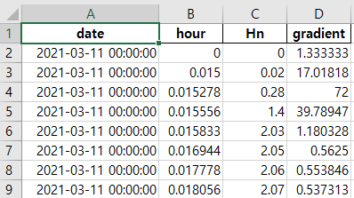

Gradient Calculator
==
파이썬으로 작성된 기울기(Gradient) 계산기 입니다.

Installation
==
* Python 3.6 설치 [URL](https://www.python.org/downloads/release/python-368/)
* 라이브러리 설치
```
명령 프롬프트 실행 후, 아래 명령어 입력.
>> python -m pip install numpy matplotlib pandas argparse pathlib openpyxl xlrd
```
* 스크립트 다운로드
```
현재 화면 (혹은 아래 url에 접속).
https://github.com/shjeon90/GradientCalculator

우측 상단의 녹색 code 버튼 클릭 후, Download ZIP 버튼 클릭.

다운로드된 파일을 압축해제.
```
* 스크립트 실행
```
명령 프롬프트 실행 후, 아래 명령어 입력.
>> python gradient.py --fpath [데이터 파일이 보관된 디렉토리 경로] --opath [분석 결과 저장 경로] [-MS]

예시 (ms 포함인 경우):
>> python gradient.py --fpath C:\ --opath C:\ -MS

예시 (ms 포함하지 않는 경우):
>> python gradient.py --fpath C:\ --opath C:\ 

예시 (한글이나 공백문자를 포함하는 경로):
>> python gradient.py --fpath "C:\한글\공백 문자\" --opath "C:\공백 문자"
```

Output files
==
opath에 명시한 경로에 [파일명]-output.xlsx 파일이 생성됨.

